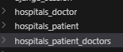
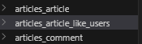

# Many to Many relationships (N:M or M:N)

- 한 테이블의 0개 이상의 레코드가 다른 테이블의 0개 이상의 레코드와 관련된 경우
- **양쪽 모두에서 N:1 관계를 가짐**

## M:N 관계의 역할과 필요성 이해하기

- '병원 진료 시스템 모델 관계'를 만들며 M:N 관계의 역할과 필요성 이해하기
- 환자와 의사 2개의 모델을 사용하여 모델 구조 구상하기

### N:1의 한계

1. 의사와 환자 간 모델 관계 설정

- 한 명의 의사에게 여러 환자가 예약할 수 있도록 설계

2. 의사와 환자 데이터 생성

- 2명의 의사와 환자를 생성하고 환자는 서로 다른 의사에게 예약

3. N:1의 한계 상황

- 1번 환자가 두 의사에게 모두 진료를 받고자 한다면 환자 테이블에 1번 환자 데이터가 중복으로 입력될 수 밖에 없음.
- 동시에 예약을 남길 수는 없나?
- 동일한 환자지만 다른 의사에게도 진료 받기 위해 예약하기 위해서는 객체를 하나 더 만들어야 한다.
- **예약 테이블 따로 만들기!**

### 중개 모델

- N:M의 핵심 요소

1. 예약 모델 생성

- 환자 모델의 외래키를 삭제하고 별도의 예약 모델을 새로 생성한다.
- 예약 모델은 의사와 환자에게 각각 N:1의 관계를 가진다.

2. 예약 데이터 생성

- 의사와 환자 생성 후 예약 만들기  
=> 예약 데이터를 직접 만든다..? 어색함.. 

3. 예약 정보 조회

- 예약이라는 것을 조회를 하려면 **두 번의 역참조**가 필요함.
- 의사와 환자가 예약 모델을 통해, 각각 본인의 진료 내역 확인

4. 추가 예약 생성

## ManyToManyField

- M:N 관계 설정 모델 필드
- **중개 모델을 자동으로 생성**한다.

### 특징

  
    - ManyToManyField는 두 모델 중 하나에 들어가면 된다. (어디에 들어가든 상관없음.)
    - **양방향 관계** (어느 모델에서든 관련 객체에 접근할 수 있음.)
        - **참조/역참조 관계**만 잘 기억하면 된다. (누가 참조인지!)
            - 안에 들어있는 필드를 참조하는 것!
    - **중복 방지** (동일한 관계는 한 번만 저장된다.)

- 원래 예약 데이터를 생성했다면, 이번에는 저절로 만들어질 수 있도록 한다.
    - .add() 사용 : 관계 추가
        - 참조 역참조에 모두 사용할 수 있음!
    - remove() 사용 : 관계 삭제

- 만약 예약 정보에 병의 증상, 예약일 등 추가 정보가 포함되어야 한다면??

### 대표인자 3가지

1. `through` argument

- 중개 테이블에 **추가 데이터**를 사용해 M:N 관계를 형성하려는 경우에 사용

2. `related_name` argument

- 역참조시 사용하는 manager name을 변경

3. `symmetrical` argument

- 관계 설정 시 대칭 유무 설정
- `ManyToManyField` 가 동일한 모델을 가리키는 정의에서만 사용
- 기본값 : True
    - source 모델의 인스턴스가 target 모델의 인스턴스를 참조하면 자동으로 target 모델 인스턴스도 source 모델 인스턴스를 자동으로 참조하도록 한다. (대칭)
    - 즉, 내가 당신의 친구라면 자동으로 당신도 내 친구가 된다.

- False라면
    - True와 반대 (대칭 X)

※ source 모델 : 관계를 시작하는 모델  
※ target 모델 : 관계의 대상이 되는 모델

---

# 좋아요 '기능' 구현하기

- 게시글에 좋아요를 누른 모든 유저 조회
    - Article -> User (참조)
    - `특정게시글.users.all()` (좋아요를 조회하는 것 같지 않음..)
    - `특정게시글.like_users.all()` (기능 명시 중요함!)

- 특정 사용자가 좋아요를 누른 모든 게시글
    - User -> Article (역참조)
    - `특정사용자.article_set.all()`

## 모델 관계 설정

- Article (M) : User(N)
    - 게시글은 회원으로부터 0개 이상의 좋아요를 받을 수 있고, 회원은 0개 이상의 게시글에 좋아요를 누를 수 있다.
- 좋아요 : 게시글 안의 요소로 판단하는 경우가 많음.
- M:N 관계 설정 시, 그냥 복수형으로 이름을 짓는 것보다, 지금 우리가 만드는 기능이 무엇인지 생각해보고 명시적인 매니저 이름을 설정하는 것이 좋다.

※ **[ERROR]**
articles.Article.like_users: (fields.E304) Reverse accessor 'User.article_set' for 'articles.Article.like_users' clashes with reverse accessor for 'articles.Article.user'.

- 역참조끼리 충돌이 났다!
- 이미 article은 user와 N:1 관계 형성
    - article.user : 참조
    - user.article_set.메서드() : 역참조
- 그런데 article과 like_users(user) (N:M) 관계 형성
    - article.like_users : 참조
    - user.article_set : 역참조

- user.article_set이 겹친다.
    - 이름을 바꿔준다! (헷갈리지 않도록)
    - N:M을 바꿔주기 >> 복수형으로

### User-Article 간 사용 가능한 전체 related manager

- article.user
    - 게시글을 작성한 유저 - N:1

- user.article_set
    - 유저가 작성한 게시글 (역참조) - N:1

- article.like_users
    - 게시글을 좋아요한 유저 - M:N

- user.like_articles
    - 유저가 좋아요한 게시글 (역참조) - M:N

## 기능 구현

1. url 작성

2. view 작성

3. 템플릿 구현

4. DB 확인

---

# 팔로우 기능 구현하기

## 프로필 페이지

- 각 회원의 개인 프로필 페이지에 팔로우 기능을 구현하기 위해 프로필 페이지를 먼저 구현하기

## 모델 관계 설정

- User (N) : User (M) - 0명 이상의 회원은 0명 이상의 회원과 관련
    - 회원은 0명 이상의 팔로워를 가질 수 있고, 0명 이상의 다른 회원들을 팔로잉 할 수 있음.

- ManyToManyField >> `symmetrical=False`
    - 참조 : 내가 팔로우하는 사람들 (팔로잉 : followings)
    - 역참조 : 상대방 입장에서 나는 팔로워 중 한 명 (팔로워, followers)

---

# Fixtures

- Django 개발 시, DB 초기화 및 공유를 위해 사용되는 파일 형식

## 사용 목적

- 샘플, 초기 데이터 세팅
- 협업 시 동일한 데이터 환경 맞추기

    - 초기 데이터의 필요성
        - 협업하는 유저 A, B가 있다고 생각하면,
        1. A가 먼저 프로젝트를 작업한 후, 원격 저장소에 push 진행 (.gitignore >> DB 공유 X)
        2. B가 원격 저장소에서 A가 push한 프로젝트를 pull (DB 없음)
    
    - 프로젝트 앱을 처음 설정할 때, 동일하게 준비된 데이터로 데이터베이스를 미리 채우는 것이 필요한 순간이 있다.

    **=> Django에서는 fixtures를 사용해 앱에 초기 데이터(initial data)를 제공한다.**

## 관련 명령어

- dumpdata : 생성 (데이터 추출)
- loaddata : 로드 (데이터 입력)

## 사전준비

- M:N 까지 모두 작성된 Django 프로젝트에서 유저, 게시글, 댓글 등 각 데이터를 최소 2~3개 이상 생성해두기

## dumpdata

- DB의 특정 모델 혹은 앱 전체 데이터 추출

### 기본 명령어

- `$ python manage.py dumpdata [앱이름.모델이름] [옵션] > 추출파일명.json`

    - 앱이름.모델이름 지정
        - 특정 모델의 데이터를 추출
    
    - 앱이름만 지정
        - 해당 앱의 모든 모델에 대한 데이터를 추출

    - 앱 혹은 모델명을 지정하지 않은 경우
        - 프로젝트 전체의 모델 데이터를 추출

    - `--format` 옵션을 통해 JSON, YMAL 등의 형식 지정 가능

## loaddata

- dumpdata를 통해 추출한 데이터 파일을 다시 DB에 반영

### 기본 명령어

- `$ python manage.py loaddata 파일경로`

    - Fixtures 파일의 기본 경로에 있는 파일을 DB에 반영
    - Fixtures 파일의 기본 경로
        - `app_name/fixtures/`

    - Django는 설치된 모든 app의 디렉토리에서 fixtures 폴더 이후의 경로로 fixtures 파일을 찾아 load를 진행

※ 모델의 관계에 따라 **load 순서가 중요**하다.

- 그래서, fixtures 파일명으로 순서를 파악할 수 있도록 한다.

---

# Improve Query

- "query 개선하기"
- 같은 결과를 얻기 위해 DB 측에 보내는 query 개수를 점차 줄여 조회

※ Toolbar 사용해서 SQL 시간 확인하면서 디버깅하기

## annotate

- SQL의 `GROUP BY`를 사용
- 쿼리셋의 각 객체에 계산된 필드를 추가
- **집계 함수 (Count, Sum 등)**와 함께 자주 사용된다.

## select_related

- SQL의 `INNER JOIN`을 사용
- 1:1 또는 N:1 참조 관계에서 사용
    - ForeignKey나 OneToOneField 관계에 대해 JOIN을 수행

- **단일 쿼리**로 관련 객체를 함께 가져와 성능을 향상

## prefetch_related

- SQL이 아닌 Python을 사용한 JOIN 진행
    - **관련 객체들을 미리 가져와** 메모리에 저장해 성능을 향상한다.

- **M:N 또는 N:1 역참조 관계**에서 사용
    - ManyToManyField나 역참조 관계에 대해 별도의 쿼리를 실행

- 역참조 관계의 데이터는 해당 모델이 가지고 있지 않기 때문에 미리 쫙 가져와서 매핑한 후 사용한다.