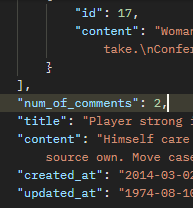

# DRF

## REST API

- API (Application Programming Interface) : 두 소프트웨어가 서로 통신할 수 있게 하는 메커니즘
    - **클라이언트-서버처럼 서로 다른 프로그램에서 요청과 응답을 받을 수 있도록 만든 체계**

## API 역할

- 예를 들어, 우리집 냉장고에 전기를 공급해야 한다고 가정
    - 우리는 그냥 냉장고의 플러그를 소켓에 꽂으면 제품이 작동함.
    - 중요한 것은 우리가 가전 제품에 "전기를 공급하기 위해 직접 배선을 하지 않는다."
    - 이는 매우 위험하면서도 비효율적임  
    => 복잡한 코드를 추상화하여 대신 사용할 수 있는 몇 가지 더 쉬운 구문 제공

## REST (Representational State Transfer)

- API Server를 개발하기 위한 일종의 소프트웨어 설계 방법론  
=> API Server를 설계라는 구조가 서로 다르니 이렇게 맞춰서 하는 것이 어때?

### RESTful API

- REST라는 설계 디자인 약속을 지켜 구현한 API
- REST 원리를 따르는 시스템을 RESTful하다고 부른다.
- **자원(데이터)를 어떻게 정의**?, **지원에 대한 주소를 어떻게 지정**?  
=> 각각 API 서버 구조를 작성하는 모습이 다르니깐 어느 정도 약속을 만들어서 다같이 통일해서 쓰자

### REST에서 자원을 정의하고 주소를 지정하는 방법

1. 자원의 '식별'
    
    - URI (Uniform Resource Identifier, 통합 자원 식별자)
    - 웹에서 **자원을 구별하기 위한 주소**가 필요하다.
    - URI > URL (URI가 URL보다 넓은 범위)
        
        - URL : 통합 자원 위치
        - **네트워크 상에 리소스가 어디 있는지 알려주기 위한 약속**
        
        1. Schema (or Protocol)
            - 브라우저가 리소스를 요청하는 데 사용하는 규약
            - URL의 첫 부분은 브라우저가 어떤 규약을 사용하는지를 나타낸다.
            - 기본적으로 웹은 http(s(=security))를 요구한다.
                - 메일을 열기 위한 mailto:, 파일을 전송하기 위한 ftp: 등 다른 프로토콜도 존재한다.
        
        2. Domain name
            - 요청 중인 웹 서버를 나타냄
            - 어떤 웹 서버가 요구되는 지를 가리키며 직접 IP 주소를 사용하는 것도 가능하지만, 사람이 외우기 어렵기 때문에 주로 Domain Name으로 사용
                - ex) 도메인 google.com의 IP 주소 = 142.251.42.142

        3. Port
            - 웹 서버의 **리소스에 접근하는 것에 사용되는 기술적인 문 (Gate)**
                - 우리가 웹 서핑을 할 때는 사용하지 않음. (표준 포트만 작성 시, 생략 가능)
            - HTTP 프로토콜의 표준 포트
                - HTTP : 80
                - HTTPS : 443

        4. Path
            - 웹 서버의 리소스 경로 (원하는 자원이 있는 곳)
            - 초기에는 실제 파일이 위치한 물리적 위치를 나타냈지만, 오늘날은 실제 위치가 아닌 추상화된 형태의 구조를 표현한다.
                - ex) `articles/create/`라는 주소가 실제 articles 폴더 안의 create 폴더 안을 나타 내는 것은 아님.

        5. Parameters
            - **웹 서버에 제공하는 추가 데이터**
            - `&` 기호로 구분되는 key-value 쌍 목록
            - **GET 방식으로 전송**할 때, 파라미터 형식으로 전송된다.
            - 서버는 리소스를 응답하기 전에 이러한 파라미터를 사용하여 추가 작업을 수행할 수 있음.

        6. Anchor
            - 일종의 **북마크**를 나타내며 브라우저 해당 지점에 있는 콘텐츠를 표시한다.
            - `#` : 브라우저가 컨트롤 (서버와는 관련 없음. 서버에 전송하지도 않음.)

2. 자원의 '행위'
    - HTTP request methods (= HTTP verbs) (GET, POST, ...) : 리소스에 대한 행위 (수행하고자 하는 동작)을 정의
        1. GET
            - 서버에 리소스의 표현을 요청
            - GET을 사용하는 요청은 **데이터만 검색**(**조회**)해야 한다.
        
        2. POST
            - 데이터를 지정된 **리소스에 제출** (**생성**)
            - 서버의 상태를 변경
        
        3. PUT
            - 요청한 주소의 리소스를 **수정**
        
        4. DELETE
            - 지정된 리소스를 **삭제**

    - HTTP response status code : 특정 HTTP 요청이 성공적으로 완료되었는지 여부를 나타냄
        - 100-199 : Informational responses
        - 200-299 : Successful responses
        - 300-399 : Redirection messages
        - 400-499 : Client error responses
        - 500-599 : Server error responses

3. 자원의 '표현'
    - JSON 데이터 (궁극적으로 표현되는 데이터 결과물)

---

## django REST framework

- django에서 RESTful API 서버를 쉽게 구축할 수 있도록 도와주는 오픈소스 라이브러리
- djangorestframework 설치 필요 [Django REST framework](https://www.django-rest-framework.org/)

---

- 어떤 게시글의 댓글을 **작성**하기 위해서는 게시글의 pk(**FK**)가 필요하다.
    - url 다르게 구성되어야 함.

- url, api는 초반에 설정한다.

### 특정 게시글에 댓글을 작성하는 방법

- 외래키 가져올 때, Form에서는 commit=False 한 후, 외래 키 넣어주고 다시 저장했다. 하지만, 지금은 DRF 이기 때문에 문법이 다르다. save()의 인자로 외래키를 넣어주면 된다.
- serializer 설정도 다시 해주어야 한다.
    - `fields = '__all__'`을 해준다면, 모든 필드를 유효성 검사한다.
    - 이때, 외래 키는 유효성 검사를 하지 않아도 된다. 왜냐면, 외래 키는 이미 저장된 데이터이고, 외부에서 들어오는 데이터가 아니기 때문이다.
    - 따라서, 외래 키는 **읽기 전용 필드**로 바꿔주어야 한다.
        - 유효성 검사 목록 제외!, but, 응답 데이터에는 존재!

### 응답 데이터 재구성하기

- 댓글 조회 시, 게시글 번호만 제공하는 것이 아닌 **내용**을 준다.
- 게시글의 내용을 가공해주는 시리얼라이저가 필요하다!

## 역참조 데이터 구성

- 게시글, 댓글 간 역참조 관계를 활용한 JSON 데이터 재구성하기
    1. 단일 게시글 조회 시, 해당 게시글에 작성된 댓글 목록도 함께 붙여서 응답
        - Nested relationships (역참조 매니저 활용)
            - 모델 관계 상으로 참조하는 대상은 참조되는 대상의 표현에 포함되거나 중첩될 수 있다.
            - 이러한 중첩 관계는 serializers를 필드로 사용해 표현이 가능하다.

    2. 단일 게시글 조회 시, 해당 게시글에 작성된 댓글 개수도 함께 붙여서 응답
        - views.py에서 annotate 사용 -> num_of_comments 추가하기
            - annotate : **SQL의 집계 함수**를 활용해서 쿼리 단계에서 데이터 가공을 수행한다.

        - serializer.data를 반환하면, 해당 article 객체에는 num_of_comments가 포함된다.

### Serializer 개선 : SerializerMethodField 사용하기

- 읽기 전용 필드를 커스터마이징하는 것에 사용한다.
- Serializer에서 추가적인 데이터 가공을 하고 싶을 때 사용한다.

- `get_<필드명>` 함수 정의
    - serializer.data를 호출할 때, `get_<필드명>` 메서드가 실행되어, 자동으로 값이 추가 된다.
    

- 동작 원리
    1. `SerializerMethodField`를 `Serializer` 클래스 내에서 필드로 선언하면, DRF는 `get_<필드명>`이라는 이름을 가진 메서드를 자동으로 찾는다.
        - ex) `full_name = serializers.SerializerMethodField()` 라고 선언하면, DRF는 `get_full_name(self, obj)` 메서드를 찾아 해당 값을 직렬화 결과에 넣어준다.
    2. obj는 현재 직렬화 중인 모델 인스턴스이고, obj의 속성이나, annotate된 필드를 활용해서 새로운 값을 만들 수 있다.

- 주의사항
    1. 읽기 전용으로, 생성, 수정 요청 시에는 사용되지 않는다.
    2. get_ 메서드는 반드시 (self, obj) 형태로 정의해야 한다. obj는 현재 직렬화 중인 모델 인스턴스를 의미한다.

- 사용 목적
    1. 유연성 : 다양한 계산 로직을 손쉽게 추가 가능
    2. 가독성 : 데이터 변환 과정을 serializer 내부 메서드로 명확히 분리
    3. 유지보수성 : view나 model에 비해 Serializer측 로직 변경이 용이
    4. 일관성 : view에서 별도로 data 수정 없이도 직렬화 결과를 제어

---

## API 문서화

- OpenAPI Specification (OAS) : RESTful API를 설명하고 시각화하는 표준화된 방법
    - API에 대한 세부사항을 기술할 수 있는 공식 표준

- Swagger, Redoc : OAS 기반 API에 대한 문서를 생성하는 데 도움을 주는 오픈소스 프레임워크

### 문서화 활용

- drf-spectacular

- 설계 우선 접근법

### 참고

- 404 에러
- django shortcuts functions
    - `get_object_or_404`
    - `get_list_or_404`

- **View와 Serialzier 의 역할**
    - 비즈니스 로직(데이터 가공, annotate, 필터링) : view나 queryset 로직에서 처리
    - 결과물을 직렬화 : serializer
    - 복잡한 query나 로직 : Views.py
