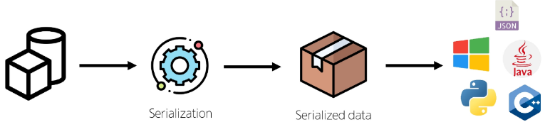

# Serializer

- 여러 시스템에서 활용하기 위해 데이터 구조나 객체 상태를 나중에 재구성할 수 있는 포맷으로 변환하는 과정

- 장고에서만 사용할 수 있는 데이터를 다양한 응답 객체에게 전송해야 한다.
- 이때, 사용가능한 형식으로 전송해야 한다.
- serializer를 이용해 유연한 데이터로 전송할 수 있다.

- Serialization : 어떠한 언어나 환경에서도 나중에 다시 쉽게 사용할 수 있는 포맷으로 변환하는 과정
    - Serializer가 담당하는 부분.

- ModelSerializer : Django 모델과 연결된 Serializer 클래스
    - 일반 Serializer와 달리 사용자 입력 데이터를 받아 자동으로 모델 필드에 맞추어 Serialization을 진행

※ DRF의 serializer가 django의 model과 비슷한 이유  
- DRF 사용자는 Django 기반의 개발자라고 생각해 Django 기반의 문법으로 만들어두었음.